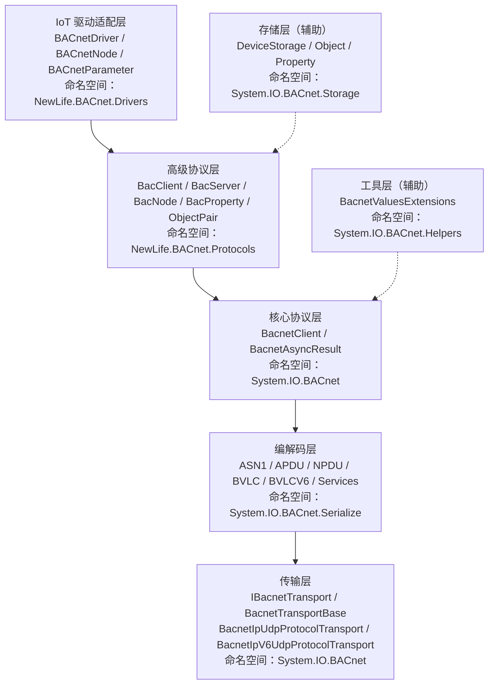
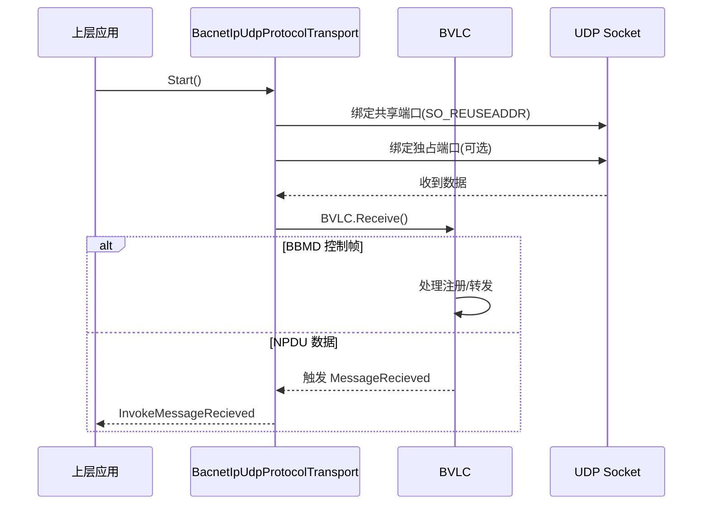
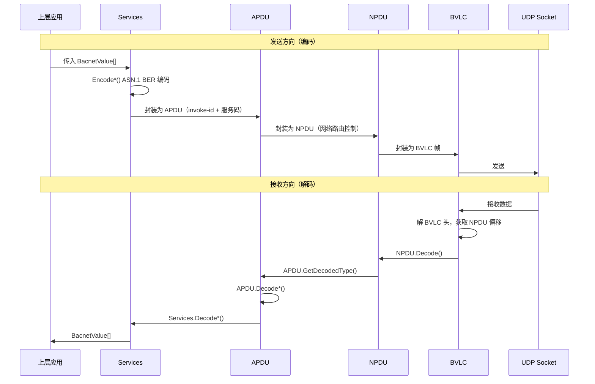
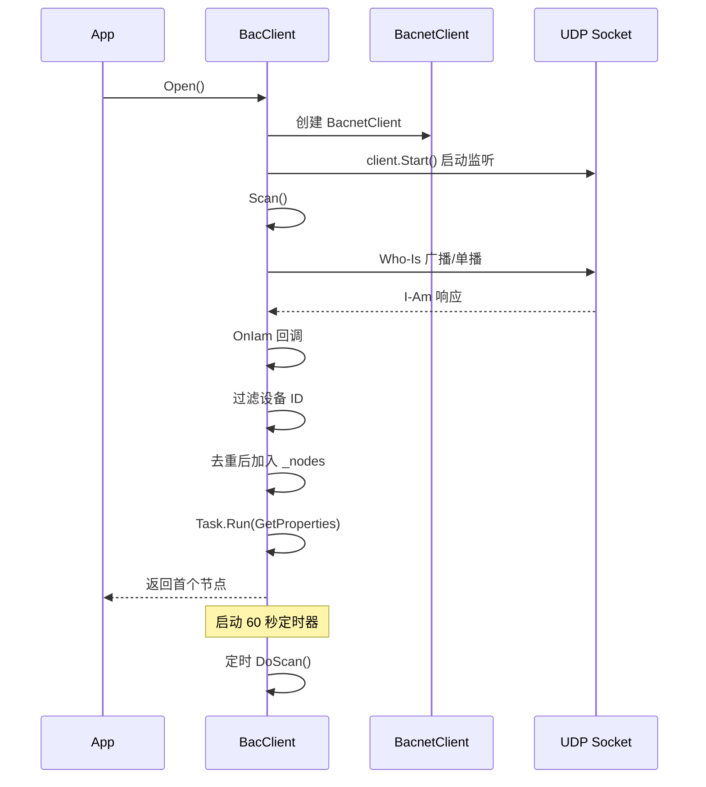
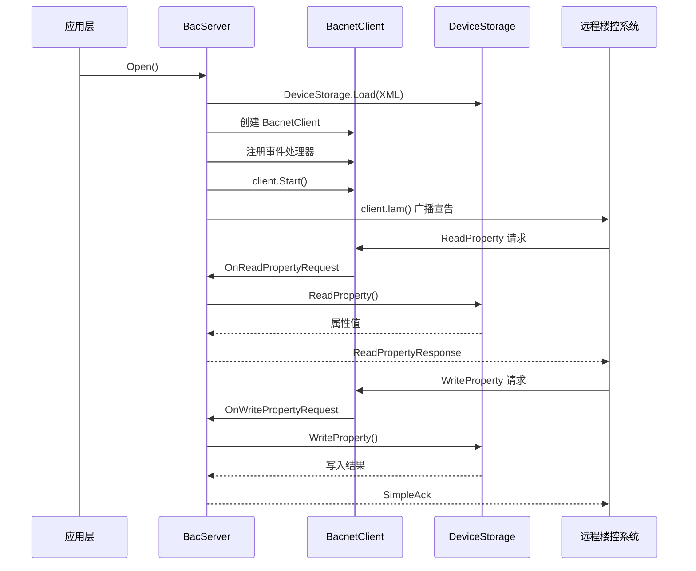
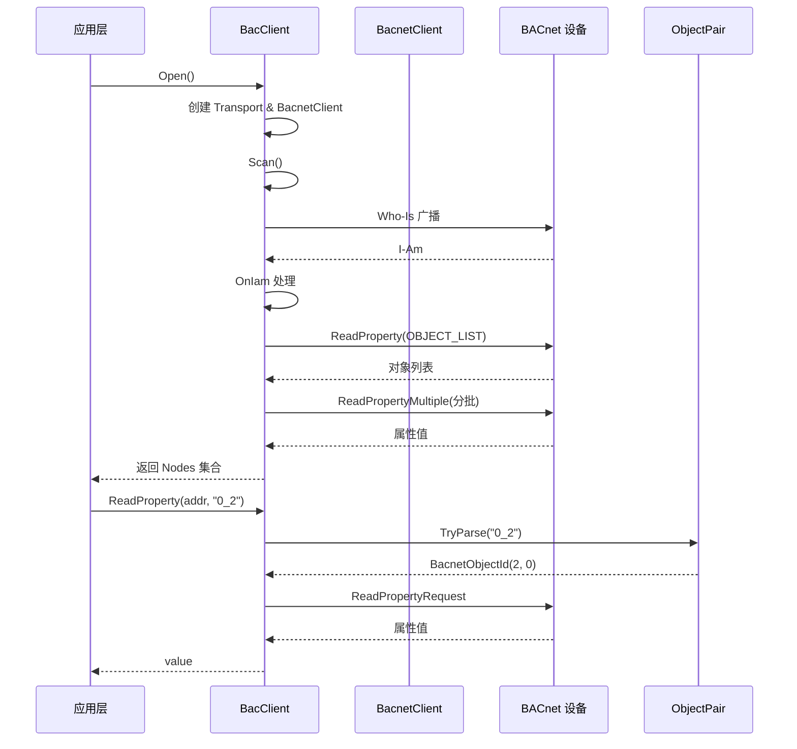
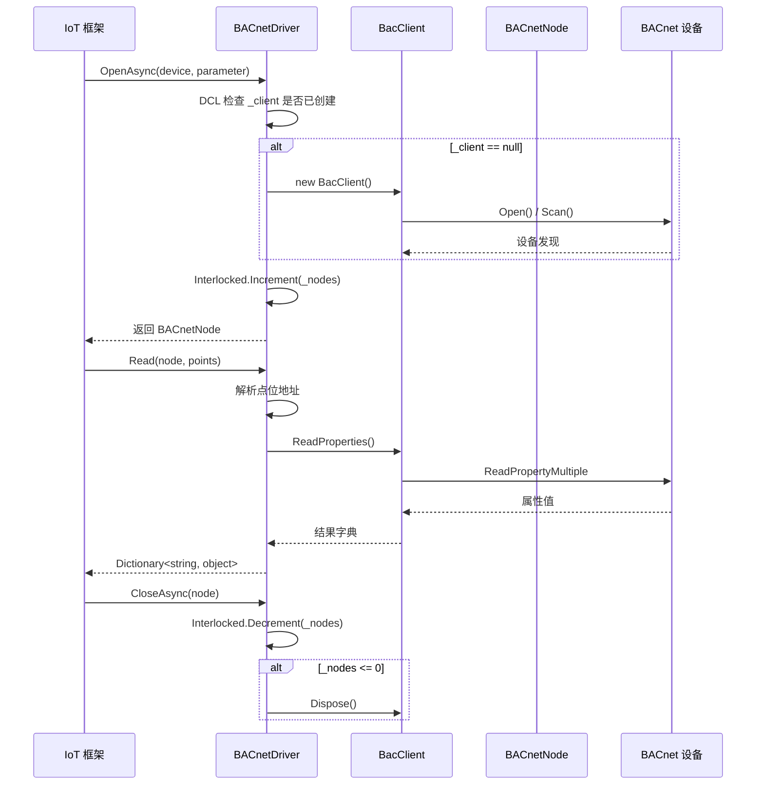

# NewLife.BACnet 架构设计

> 版本：v1.0 | 日期：2026-07-22
> 需求对应：[需求文档](需求文档.md) | 功能清单：[功能清单](功能清单.md)

---

## 1. 整体架构

### 1.1 五层分层架构

NewLife.BACnet 采用严格的五层架构，每层职责单一，依赖方向从上到下，高层调用低层，低层通过接口和事件通知高层。



### 1.2 设计原则

| 原则 | 说明 |
|------|------|
| **单向依赖** | 高层依赖低层，低层不依赖高层，通过事件向上通知 |
| **接口抽象** | 传输层通过 `IBacnetTransport` 接口抽象，支持多种传输方式注入 |
| **可观测性** | 所有核心组件实现 `ITracerFeature` 和 `ILogFeature`，便于集成 APM |
| **单例连接** | IoT 驱动层多节点共享单一 `BacClient` 连接，引用计数管理生命周期 |

---

## 2. TRN 传输层

### 2.1 职责

提供不同物理/网络媒体的 BACnet 数据传输能力。

### 2.2 核心组件

| 组件 | 所在工程 | 说明 |
|------|----------|------|
| `IBacnetTransport` | NewLife.BACnet | 传输层接口，定义 `Start()`/`Send()`/`GetBroadcastAddress()` 及 `MessageRecieved` 事件 |
| `BacnetTransportBase` | NewLife.BACnet | 抽象基类，提供 `Tracer`/`Log` 注入点和 `InvokeMessageRecieved()` 统一触发入口 |
| `BacnetIpUdpProtocolTransport` | NewLife.BACnet | IPv4 UDP 传输实现，共享端口 + 独占端口双 socket 模式 |
| `BacnetIpV6UdpProtocolTransport` | NewLife.BACnet | IPv6 UDP 传输实现，3 字节虚拟 MAC 地址 |

### 2.3 关键流程



### 2.4 设计决策

| 决策 | 选项 | 选择 | 理由 |
|------|------|------|------|
| 端口模式 | 单端口 / 共享+独占双端口 | 双端口 | 共享端口接收广播，独占端口隔离单播响应，防止与其他进程冲突 |
| MS/TP 串口 | 启用 / 禁用 | 禁用（编译排除） | 跨平台串口兼容性无法保证，保留代码待后续启用 |

---

## 3. COD 协议编解码

### 3.1 职责

实现 BACnet 各层协议的编码和解码，确保与标准设备的互操作性。

### 3.2 核心组件

| 组件 | 所在工程 | 说明 |
|------|----------|------|
| `ASN1` | NewLife.BACnet | BACnet 专有 TLV 编解码核心类，约 120+ 个编码/解码方法 |
| `APDU` | NewLife.BACnet | 应用协议数据单元编解码，支持 10+ 种 PDU 类型 |
| `NPDU` | NewLife.BACnet | 网络协议数据单元编解码，支持源/目标地址和跳数管理 |
| `BVLC` | NewLife.BACnet | BACnet/IP (IPv4) 虚拟链路控制层编解码，含 BBMD 状态管理 |
| `BVLCV6` | NewLife.BACnet | BACnet/IP (IPv6) 虚拟链路控制层编解码 |
| `Services` | NewLife.BACnet | BACnet 应用服务编码/解码，映射确认/未确认服务到 ASN.1 编码 |
| `EncodeBuffer` | NewLife.BACnet | 可扩展编码缓冲区，支持分片滑动窗口写入 |
| `MSTP` | NewLife.BACnet | MS/TP 帧编解码（CRC 计算、帧编码/解码） |
| `PTP` | NewLife.BACnet | PTP 帧编解码 |

### 3.3 关键流程



### 3.4 设计决策

| 决策 | 选项 | 选择 | 理由 |
|------|------|------|------|
| ASN.1 编码风格 | 标准 BER / 简化 TLV | 简化 TLV | BACnet 标准定义的专有编码方式 |
| 编码缓冲区模型 | 固定大小 / 可扩展 | 可扩展 | 适应不同大小的 APDU，减少预分配浪费 |
| CustomTagResolver | 实例方法 / 静态委托 | 静态委托 | 全局单一注册点，无需实例化即可使用 |

---

## 4. DSC 设备发现

### 4.1 职责

在 BACnet 网络中自动发现在线设备。

### 4.2 核心组件

| 组件 | 所在工程 | 说明 |
|------|----------|------|
| `BacnetClient.WhoIs()` | NewLife.BACnet | 底层 Who-Is 请求发送（广播/单播） |
| `BacnetClient.OnIam` | NewLife.BACnet | I-Am 响应事件处理 |
| `BacClient.Scan()` | NewLife.BACnet | 高级 API：发送 Who-Is 并等待首个响应 |
| `BacClient.OnIam` | NewLife.BACnet | 节点发现与去重逻辑 |
| `BacClient._timer` | NewLife.BACnet | 定时重扫定时器（默认 60 秒） |

### 4.3 关键流程



---

## 5. PRP 属性读写

### 5.1 职责

读取和写入 BACnet 设备对象的属性值。

### 5.2 核心组件

| 组件 | 所在工程 | 说明 |
|------|----------|------|
| `BacnetClient.ReadPropertyRequest()` | NewLife.BACnet | 底层 ReadProperty 请求 |
| `BacnetClient.WritePropertyRequest()` | NewLife.BACnet | 底层 WriteProperty 请求 |
| `BacnetClient.ReadPropertyMultipleRequest()` | NewLife.BACnet | 底层 ReadPropertyMultiple 请求 |
| `BacnetClient.WritePropertyMultipleRequest()` | NewLife.BACnet | 底层 WritePropertyMultiple 请求 |
| `BacClient.ReadProperty()` | NewLife.BACnet | 高级 API：按 ObjectId 或字符串地址读取 |
| `BacClient.ReadProperties()` | NewLife.BACnet | 高级 API：批量读取，支持分批 |
| `BacClient.WriteProperty()` | NewLife.BACnet | 高级 API：写入 |
| `BacClient.WriteProperties()` | NewLife.BACnet | 高级 API：批量写入 |
| `BacClient.GetDetail()` | NewLife.BACnet | 获取属性详细信息 |

### 5.3 设计决策

| 决策 | 选项 | 选择 | 理由 |
|------|------|------|------|
| invoke-id 管理 | 全局共享 / 按设备隔离 | 全局共享（当前） | 实现简单，但存在多设备并发冲突风险；TODO 已知 |

---

## 6. COV COV 变更通知

### 6.1 职责

订阅设备属性变化并实时推送。

### 6.2 核心组件

| 组件 | 所在工程 | 说明 |
|------|----------|------|
| `BacnetClient.SubscribeCOV()` | NewLife.BACnet | 发送 SubscribeCOV 请求 |
| `BacnetClient.SubscribeCOVProperty()` | NewLife.BACnet | 发送 SubscribeCOVProperty 请求（带阈值） |
| `BacnetClient.OnCOVNotification` | NewLife.BACnet | 接收无确认 COV 通知 |
| `DeviceStorage.ChangeOfValue` | NewLife.BACnet | 服务端属性变化事件，触发 COV 通知 |

---

## 7. EVT 事件与报警

### 7.1 职责

处理 BACnet 事件通知、报警摘要与确认。

### 7.2 核心组件

| 组件 | 所在工程 | 说明 |
|------|----------|------|
| `BacnetClient.OnEventNotification` | NewLife.BACnet | 接收 EventNotification 事件 |
| `BacnetClient.ConfirmedEventNotification()` | NewLife.BACnet | 发送有确认事件通知 |
| `BacnetClient.GetAlarmSummary()` | NewLife.BACnet | 获取报警摘要 |
| `BacnetClient.GetEventInformation()` | NewLife.BACnet | 获取详细事件信息 |
| `BacnetClient.AcknowledgeAlarm()` | NewLife.BACnet | 确认报警 |

---

## 8. FIL 文件访问 & OBJ 对象管理

### 8.1 职责

通过 BACnet 文件服务读写设备文件，以及动态管理设备对象。

### 8.2 核心组件

| 组件 | 所在工程 | 说明 |
|------|----------|------|
| `BacnetClient.AtomicReadFile()` | NewLife.BACnet | 原子读文件 |
| `BacnetClient.AtomicWriteFile()` | NewLife.BACnet | 原子写文件 |
| `BacnetClient.CreateObject()` | NewLife.BACnet | 创建对象 |
| `BacnetClient.DeleteObject()` | NewLife.BACnet | 删除对象 |
| `BacnetClient.AddListElement()` | NewLife.BACnet | 列表添加元素 |
| `BacnetClient.RemoveListElement()` | NewLife.BACnet | 列表移除元素 |

---

## 9. SRV BACnet 服务端

### 9.1 职责

将 .NET 应用暴露为 BACnet 设备，供第三方楼控系统读写。

### 9.2 核心组件

| 组件 | 所在工程 | 说明 |
|------|----------|------|
| `BacServer` | NewLife.BACnet | 服务端主类，封装 BacnetClient 事件处理逻辑 |
| `DeviceStorage` | NewLife.BACnet | 设备对象属性存储，支持 XML 序列化/反序列化 |
| `Object` | NewLife.BACnet | BACnet 对象的 CLR 表示 |
| `Property` | NewLife.BACnet | BACnet 属性的 CLR 表示 |

### 9.3 关键流程



### 9.4 设计决策

| 决策 | 选项 | 选择 | 理由 |
|------|------|------|------|
| 属性存储格式 | XML / JSON / 内存 | XML + 内存 | XML 便于人工编辑和版本管理，内存镜像提高读写性能 |
| 读写覆盖机制 | 虚拟方法 / 事件委托 | 事件委托 | 更灵活，多个订阅者可叠加处理 |

---

## 10. CLI 高级客户端 API

### 10.1 职责

在低层 `BacnetClient` 之上封装面向业务的高级 API，简化开发。

### 10.2 核心组件

| 组件 | 所在工程 | 说明 |
|------|----------|------|
| `BacClient` | NewLife.BACnet | 高级客户端主类，管理生命周期、设备发现、属性读写 |
| `BacNode` | NewLife.BACnet | 已发现设备节点，携带地址、设备 ID、属性集合 |
| `BacProperty` | NewLife.BACnet | 属性描述，含对象 ID、名称、值、类型、描述 |
| `ObjectPair` | NewLife.BACnet | 点位地址解析工具 |

### 10.3 关键流程



---

## 11. DRV IoT 驱动框架适配

### 11.1 职责

实现 NewLife.IoT 驱动接口，使 BACnet 成为可插拔的 IoT 设备驱动。

### 11.2 核心组件

| 组件 | 所在工程 | 说明 |
|------|----------|------|
| `BACnetDriver` | NewLife.BACnet | 实现 `DriverBase`，注册 `[Driver("BACnet")]`，单例连接管理 |
| `BACnetNode` | NewLife.BACnet | 实现 `INode`，携带设备 ID 和 `BacClient` 引用 |
| `BACnetParameter` | NewLife.BACnet | 实现 `IDriverParameter`，定义 Port/DeviceId/TargetAddress |

### 11.3 关键流程



### 11.4 设计决策

| 决策 | 选项 | 选择 | 理由 |
|------|------|------|------|
| 连接管理 | 每个节点独立连接 / 多节点共享 | 共享单连接 | BACnet 协议基于 UDP 广播，一个端口即可发现网络内所有设备 |

---

## 12. OBS 可观测性

### 12.1 职责

为 BACnet 通信提供日志、APM 追踪和指标。

### 12.2 核心组件

| 组件 | 所在工程 | 说明 |
|------|----------|------|
| `ITracerFeature` | NewLife.Core | APM 追踪接口，所有核心组件实现此接口 |
| `ILogFeature` | NewLife.Core | 日志接口，所有核心组件实现此接口 |

所有核心组件均实现 `ITracerFeature`（`ITracer Tracer { get; set; }`）和 `ILogFeature`（`ILog Log { get; set; }`），可在创建时注入：

```csharp
var client = new BacClient
{
    Tracer = MyTracer,    // 注入 APM 追踪器（Stardust、OpenTelemetry 等）
    Log = XTrace.Log      // 注入日志（文件、控制台等）
};
```

---

## 13. 数据模型

### 13.1 BacnetValue

| 字段 | 类型 | 说明 |
|------|------|------|
| `Tag` | `BacnetApplicationTags` | BACnet 数据类型标签，标记值所属的 BACnet 应用类型 |
| `Value` | `Object` | 实际值（装箱后的 CLR 类型） |

### 13.2 BacnetObjectId

```
编码：4 字节无符号整数
  高 10 位 = Type（0-1023，BacnetObjectTypes 枚举）
  低 22 位 = Instance（0-4194303）
```

### 13.3 BacnetAddress

| 字段 | 类型 | 说明 |
|------|------|------|
| `type` | `BacnetAddressTypes` | 地址类型：IP / Ethernet / MSTP / PTP / IPv6 |
| `net` | `ushort` | BACnet 网络号（0 = 本地网络） |
| `adr` | `byte[]` | 地址字节（IPv4=4+2 字节, IPv6=16+2 字节, MSTP=1 字节） |

---

## 14. 设计决策汇总

| 决策 | 选项 | 选择 | 理由 |
|------|------|------|------|
| 协议栈基础 | ela-compil/BACnet / 自研 | 基于 ela-compil 重构 | 复用经过验证的编解码层，集中精力构建高级 API 和 IoT 集成 |
| 目标框架 | netstandard2.0 + net45 | 双框架 | 覆盖 .NET 4.5 至 .NET 最新版，兼容性最大化 |
| 外部依赖 | NewLife.Core + NewLife.IoT | 最小依赖 | 仅有 2 个必需依赖，无本地库依赖 |
| APDU 分片策略 | 单窗口 / 滑动窗口 | 滑动窗口（最多 10 片） | 平衡传输效率和实现复杂度 |
| 属性存储线程安全 | lock / ReaderWriterLockSlim | lock | 服务端吞吐量通常不大，简单 lock 足够 |
| 异步模型 | async/await / ManualResetEvent | ManualResetEvent | 兼容 net45 无 Task 的同步 API 风格 |


**Span 埋点约定**（命名格式 `bac:{操作}`）：

| Span 名称 | 触发位置 |
|----------|---------|
| `bac:Open` | BacClient.Open()、BacServer.Open() |
| `bac:Scan` | BacClient.Scan()、BacClient.DoScan() |
| `bac:OnIam` | BacClient.OnIam()、BacServer.OnIam() |
| `bac:Read` | BacClient.ReadProperty() 系列 |
| `bac:Write` | BacClient.WriteProperty() 系列 |

---

## 9. 扩展点汇总

| 扩展点 | 接口/属性 | 用途 |
|--------|---------|------|
| 自定义传输层 | `IBacnetTransport` | 实现 MS/TP、PTP、自定义物理层 |
| 自定义标签解析 | `ASN1.CustomTagResolver` | 解析厂商私有属性标签 |
| 数据结构序列化 | `IEncode` / `IDecode` | 复杂属性值的自定义编解码 |
| 属性读写拦截 | `DeviceStorage.OnReadProperty` / `OnWriteProperty` | 服务端动态计算属性值 |
| 属性变化通知 | `DeviceStorage.OnWriteNotify` | 触发 COV 或自定义业务逻辑 |
| 日志注入 | `ILog Log { get; set; }` | 接入任意 ILog 实现 |
| 追踪注入 | `ITracer Tracer { get; set; }` | 接入 APM 系统 |

---

## 10. 关键设计决策

### 10.1 为什么 invoke-id 目前全局共享？

现有实现（`BACnetClient.cs` 第 23 行 TODO）中，`invoke-id`（0-255）对所有远程设备使用同一个计数器。在单设备场景下工作正常，但同时与多个设备通信时，不同设备的响应可能共用同一 invoke-id，导致响应匹配混乱。

**后续改进方向**：为每个 `BacnetAddress`（远程设备地址）维护独立的 invoke-id 计数器和等待队列，改用 `Dictionary<BacnetAddress, byte> _invokeIdPerDevice`。

### 10.2 为什么 MS/TP 等串口传输被禁用？

MS/TP 和 PTP 代码来源于移植自第三方实现，涉及底层串口操作。在 .NET 多框架多平台目标（netstandard2.0/net45）下，串口 API 存在兼容性差异，且需要额外测试。当前策略是保留代码，通过 `<Compile Remove>` 排除，待平台策略稳定后重新启用。

### 10.3 为什么 BacClient 使用 TaskCompletionSource 而非 ManualResetEvent？

`Scan()` 需要等待第一个 IAM 响应（异步事件），使用 `TaskCompletionSource<BacNode>` 配合 `CancellationTokenSource` 可以优雅实现超时取消语义，比 `ManualResetEvent` + `WaitOne(timeout)` 更加现代化，且不会阻塞线程池。

### 10.4 为什么存储层使用 XML 而非 JSON？

`DeviceStorage`（`DeviceDescriptor.xml`）的 XML 格式来源于原始参考实现。XML 对于描述树状对象-属性层次结构直观且易于人工编辑，适合设备描述文件场景。BACnet 标准本身也有 XML 交换格式（CSML）先例。

---

## 11. 已知缺陷与改进路线

| 编号 | 缺陷描述 | 影响 | 改进方向 | 代码位置 |
|------|---------|------|---------|---------|
| D001 | invoke-id 全局共享，多设备并发可能冲突 | 高并发多设备场景响应匹配错误 | 按 BacnetAddress 隔离 | `BACnetClient.cs:23` |
| D002 | 大批量对象未自动分批 | 超大设备（100+对象）数据包超限 | 自动按 BatchSize 分批 | `Protocols/BacClient.cs` |
| D003 | 批量读取偷发只返回 1 个点位 | IoT 驱动读数据不完整 | 已用 `lock(_client)` 绕过，待 D001 修复后彻底解决 | `Drivers/BACnetDriver.cs:134` |
| D004 | BacnetDate 第 32 天（最后一天标记）未实现 | 包含日期范围计划的设备解析异常 | 实现 day=32 的语义处理 | `Base/BacnetDate.cs:54` |
| D005 | Scan() 仅返回首个设备，后续设备异步加入 | 首次 Open() 后需等待异步完成 | 提供等待所有设备发现完成的 API | `Protocols/BacClient.cs` |
| D006 | BacnetAddress 端口字节序反转调用 Reverse() 编译失败 | netstandard2.0/net45 编译错误（CS0023） | 已修复：改用 Array.Reverse 原地反转 | `Base/BacnetAddress.cs:46` |
| D007 | BACnetClient.TrimStart(string) 返回 ReadOnlySpan<char> 编译失败 | netstandard2.0/net45 编译错误（CS0029） | 已修复：改用 Replace 移除前缀 | `BACnetClient.cs:483` |
